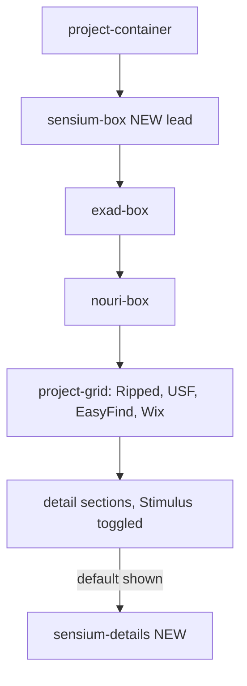

# Sensium Portfolio Integration — Master Plan

Master reference for adding **Sensium** as the new lead project on the Rails portfolio
(`laurentlefebvre.me`). Companion checklist: [`SENSIUM_INTEGRATION_TODO.md`](SENSIUM_INTEGRATION_TODO.md).

## 1. Goal

Feature Sensium as the **#1 main project** on `/project`, above EXAD, with a full
multi-platform showcase that communicates its breadth (Apple + Google + Web) and its
engineering story (one Kotlin Multiplatform core, many native shells).

## 2. About Sensium (source of truth for copy)

- **What:** premium blind-tasting grape atlas / wine-study coach.
- **Audience:** sommeliers, WSET / CMS students, serious enthusiasts.
- **Pillars:** `Train` (daily drills), `Grapes` (search + scan-first dossiers),
  `Compare` (close-call separation), `Blind` (deduction coach).
- **Architecture:** Kotlin Multiplatform shared core (models, repository, search,
  blind-scoring engine) → SwiftUI (iOS/iPadOS/macOS/visionOS/watchOS) +
  Jetpack Compose (Android/Wear OS) + static web export.
- **Backend:** Firebase (Auth, Firestore, Functions, Remote Config); offline-first local JSON.
- **Live web:** https://sensium.wine (Firebase Hosting).
- **Launch status:** store launches rolling out over the coming weeks
  (Apple App Store + Google Play "Coming Soon"); Vision Pro likely follows shortly after.
- **Source repo:** `/Users/ldlefebvre/coding/multi/sensium`.

### Brand palette
| Token | Hex |
|-------|-----|
| Garnet (primary accent) | `#6D2435` |
| Garnet dark | `#491A27` |
| Surface cream | `#FCF7F1` |
| Muted cream | `#F1E5D8` |
| Background stone | `#F7F2EC` |
| Body charcoal | `#221B17` |
| Secondary warm gray | `#5A5047` |
| Border neutral | `#D2C3B3` |

## 3. How the projects page works (existing pattern)

The `/project` page reuses one repeatable pattern per project:

1. A **feature box** (`.project-box`) in [`app/views/pages/project.html.erb`](../app/views/pages/project.html.erb).
2. A **detail partial** `app/views/projects/_<name>_details.html.erb`, rendered after a delimiter.
3. A **SCSS partial** `app/assets/stylesheets/project/_<name>_details.scss`, imported by `_index.scss`.
4. A **Stimulus controller** (`project_controller.js`) that shows one `.project-details-section`
   at a time and wires the `View Project Details` + prev/next nav buttons.

Sensium follows this exact pattern.

## 4. Asset map

All imagery copied from the Sensium repo `artifacts/` + `assets/` into
`app/assets/images/project/`:

| Portfolio path | Source |
|----------------|--------|
| `project/sensium_logo.png` | `assets/logo-concepts/best/best_logo_512px_1mb.png` |
| `project/sensium/iphone/store_01..store_11.png` | `artifacts/ios/screenshots/iphone-6.9/` |
| `project/sensium/ipad/store_01..store_10.png` | `artifacts/ios/screenshots/ipad-13/` |
| `project/sensium/android/store_01..store_10.png` | `artifacts/android/manual-screenshots/phone-pixel-8-pro/` |
| `project/sensium/android-tablet/store_01..store_10.png` | `artifacts/android/manual-screenshots/tablet-pixel-10in/` |
| `project/sensium/chromebook/store_01..store_10.png` | `artifacts/android/store-screenshots/chromebook/` |
| `project/sensium/mac/mac_01..mac_13.png` | `artifacts/macos/store-screenshots/` |
| `project/sensium/watch/watch_01..03.png` | `artifacts/watch/store-screenshots/` |
| `project/sensium/wear/wear_01..04.png` + feature graphic | `artifacts/wear/store-screenshots/` + `artifacts/wear/store-assets/` |
| `project/sensium/vision/vision_01..05.png` | `artifacts/vision/store-screenshots/` |
| `project/sensium/feature_graphic_1024x500.png` | `artifacts/android/store-assets/` |

## 5. File-by-file change list

- **`app/views/pages/project.html.erb`** — add `.sensium-box` as the first child of
  `.project-container` (logo, pitch, platform badges, Web App link, two Coming-Soon
  pseudo-buttons, `View Project Details`); render `projects/sensium_details` first.
- **`app/views/projects/_sensium_details.html.erb`** (new) — hero, "One brain, every
  screen" platform strip, the four pillars, per-platform galleries
  (iPad, Mac, Apple Watch, Wear OS, Vision Pro, Android, Android tablet, Chromebook),
  an "Under the Hood" architecture card, and prev/next nav.
- **`app/javascript/controllers/project_controller.js`** — default visible section changed
  from `exad-details` to `sensium-details`; added an accessible click-to-zoom lightbox for
  all `.project-details-section img` (Esc / click-out to close, caption carried through),
  with cleanup in `disconnect()`.
- **`app/assets/stylesheets/pages/_project.scss`** — `.project-lightbox-overlay` + `.zoomable`
  cursor styles for the lightbox.
- **`app/views/projects/_exad_details.html.erb`** — left nav button now points to
  `#sensium-details`.
- **`app/views/projects/_easyfind_details.html.erb`** — right nav button now loops to
  `#sensium-details`.
- **`app/assets/stylesheets/project/_sensium_details.scss`** (new) — garnet/cream brand
  styling for the box, platform strips, galleries (phone / wide / watch image classes),
  coming-soon buttons, and nav.
- **`app/assets/stylesheets/project/_index.scss`** — `@import "sensium_details";` first.

### Nav chain after integration
`Sensium → EXAD → Nouri → Ripped Utopia → USF → EasyFind → (loops back to Sensium)`

## 6. Detail-section content structure

1. **Hero** — product name + "Blind tasting, faster." tagline + 3 iPhone shots +
   benefit-first overview (garnet card).
2. **Highlights strip** — stat chips: 1,534 grape varieties · 4 study modes · 10 platforms ·
   offline-first · no ads/no tracking · one premium, every device.
3. **One brain, every screen** — 10-platform strip + KMP architecture note.
4. **The Four Pillars** — Train / Grapes / Compare / Blind, each with captioned iPhone shots.
5. **Beyond the Daily Loop** — SAT Rebuild & Exam Mode, Premium & account
   (pricing, RevenueCat unified entitlement).
6. **Across Every Platform** — captioned galleries for iPad, Mac (all 13 surfaces),
   Apple Watch, Wear OS, Apple Vision Pro (incl. immersive study room),
   Android, Android Tablet & Chromebook.
7. **How each platform ships** — availability table (native / universal / standalone / web).
8. **Under the Hood** — feature graphic + tech-tag row + engineering summary (KMP, SwiftUI,
   Compose, RealityKit, Firebase, RevenueCat, Stripe, QA pipeline, multi-platform CI).

All product facts (1,534-variety catalog, $8.99/mo · $59.99/yr pricing, SAT Rebuild,
Exam Mode, Mistake Replay, Coach quizzes, RevenueCat cross-platform restore, per-platform
native build strategy) and screenshot captions are sourced from the Sensium repo's own
`docs/ops/STORE_METADATA_DRAFT.md`, `docs/ops/SCREENSHOT_PLAN.md`, and
`docs/product/PRODUCT_STRATEGY_V4.md`.

## 7. Image sizing classes (SCSS)

| Class / grid | Use | Wrapper max-width |
|--------------|-----|-------------------|
| `.sensium-image` (default grid) | phone portrait shots | 200px |
| `.image-grid.sensium-wide-grid` | landscape (iPad/Mac/Vision/tablet/chromebook) | 440px |
| `.image-grid.sensium-watch-grid` | Watch / Wear | 165px |
| `.sensium-image-large` (via `:has()`) | hero / single-feature emphasis | 240px |

## 8. Verification

- `bin/rails server` → visit `/project`; Sensium shows first and its details render by default.
- Confirm every `asset_path` resolves (no broken images) — see TODO checklist.
- `ReadLints` clean on edited views/JS/SCSS.

## 9. Future enhancements (optional)

- Swap "Coming Soon" pseudo-buttons for real App Store / Google Play links at launch.
- Add a short demo video (mirroring the home page `homevid.mov` pattern).
- Add Vision Pro `vision_04_study_room.png` once a real-headset capture exists.
